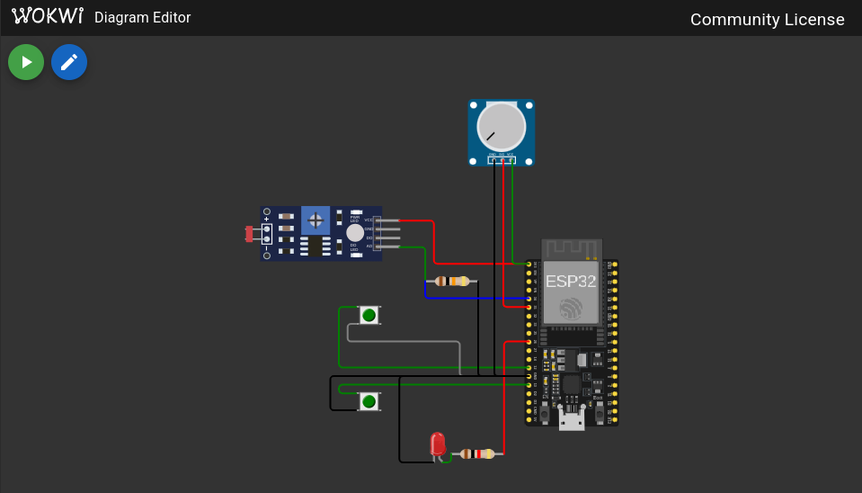

# FIAP - Faculdade de Informática e Administração Paulista

<p align="center">
    <a href= "https://www.fiap.com.br/">
        
    </a>
</p>

<br>

# FIAP ON 2025/IA - Fase 3 - Cap 1

## Sistema de Monitoramento e Irrigação Inteligente de Solo

## 👨‍🎓 Informações do Grupo: NOEPRÆXIS
|Nome Completo|RM|
|---|---|
|[ANA CAROLINA BELCHIOR](https://www.linkedin.com/in/ana-carolina-belchior-35a572355/)|RM563641|
|[CAIO PELLEGRINI](https://www.linkedin.com/in/caiopellegrini/)|RM565078|
|[LEONARDO DE SENA](https://www.linkedin.com/in/leonardosena)|RM563351|
|[VIVIAN NASCIMENTO SILVA AMORIM](https://www.linkedin.com/in/vivian-amorim-245a46b7)|RM565078|

## 👩‍🏫 Professores:
### Tutor(a)
- [Leonardo Ruiz Orabona](https://www.linkedin.com/in/leonardoorabona)
### Coordenador(a)
- [André Godoi Chiovato](https://www.linkedin.com/in/andregodoichiovato)

## 📜 Descrição

### Problema
A FarmTech Solutions enfrenta desafios no monitoramento eficiente das condições do solo em suas operações agrícolas. A falta de dados em tempo real sobre temperatura, umidade, pH e nutrientes do solo resulta em irrigação inadequada, desperdício de água e redução da produtividade das culturas.

### Setor de Atuação
Agronegócio - Agricultura de Precisão e IoT Agrícola

### Solução Proposta
Sistema integrado de monitoramento de solo baseado em ESP32 com controle automático de irrigação, captura de dados, armazenamento em banco de dados SQL e dashboard de visualização em tempo real.

## 🎯 Objetivos do Projeto

### ✅ Entrega 1: Sistema de Sensores e Controle com ESP32
- **Circuito de sensores** simulável no Wokwi
- **Código C++** para leitura de sensores e controle de irrigação
- **Lógica de controle** baseada em limiares de umidade
- **Documentação completa** com diagramas e explicações

### ✅ Entrega 2: Captura e Armazenamento de Dados
- **Script Python** para captura de dados via serial
- **Banco de dados SQL** para armazenamento persistente
- **CRUD completo** para manipulação de dados
- **Justificativa MER** relacionada com a Fase 2

### ✅ Ir Além 1: Dashboard de Visualização
- **Dashboard interativo** em Streamlit
- **Visualização em tempo real** dos sensores
- **Gráficos históricos** e análise de tendências
- **Sistema de alertas** e recomendações

## 🏗 Arquitetura Completa do Sistema

```
┌─────────────────┐
│     ESP32       │
│  (Hardware)     │
└────────┬────────┘
         │ Serial/USB
         ▼
┌─────────────────┐      ┌─────────────────┐
│ monitoring_     │────▶│ monitoring_     │
│ database        │      │ dashboard       │
│ (Python/SQL)    │◀────│ (Streamlit)     │
└─────────────────┘      └─────────────────┘
```

### 1. Hardware (ESP32):
* **Microcontrolador**: ESP32 (dual-core, 240MHz)
* **Sensores**:
    - DHT22: Temperatura e umidade do ar
    - Sensor analógico: pH do solo (0-14)
    - Botões: Simulação de detecção de fósforo e potássio
* **Atuadores**:
    - Relé (GPIO27): Controle de bomba de irrigação
    - LED integrado: Indicação de status

### 2. Software Embarcado (C++):
* **Framework**: Arduino + FreeRTOS
* **Componentes Principais**:
    - **SensorManager**: Aquisição e processamento de dados dos sensores
    - **IrrigationController**: Sistema inteligente de controle de irrigação
    - **AsyncSoilWebServer**: Interface web assíncrona com WebSockets
    - **SystemMonitor**: Monitoramento de recursos e watchdog
    - **TelemetryBuffer**: Centralização de dados para telemetria

### 3. Sistema de Captura e Armazenamento (Python):
* **Localização**: `monitoring_database/`
* **Componentes**:
    - **serial_reader.py**: Captura dados do ESP32 via serial
    - **database_manager.py**: Gerenciamento SQL com CRUD completo
    - **data_pipeline.py**: Pipeline integrado de processamento
    - **setup.py**: Configuração automática do sistema
* **Banco de Dados**: SQLite com 4 tabelas principais
    - sensor_readings: Leituras dos sensores
    - irrigation_events: Eventos de irrigação
    - alerts: Sistema de alertas
    - system_stats: Estatísticas do sistema

### 4. Dashboard de Visualização (Streamlit):
* **Localização**: `monitoring_dashboard/`
* **Funcionalidades**:
    - Visualização em tempo real com medidores gauge
    - Gráficos históricos interativos
    - Sistema de alertas categorizados
    - Análise preditiva e recomendações
    - Auto-refresh configurável (5-60s)

## 📊 Fluxo de Dados Completo

```
Sensores → ESP32 → Serial → Python → SQLite → Dashboard
   ↑                                             ↓
   └──────── Controle de Irrigação ←─────────────┘
```

1. **Aquisição**: Sensores lidos a cada 200ms pelo ESP32
2. **Transmissão**: Dados enviados via serial em formato JSON
3. **Captura**: Python lê e processa os dados seriais
4. **Armazenamento**: Dados salvos em banco SQLite
5. **Visualização**: Dashboard exibe dados em tempo real
6. **Decisão**: Sistema toma ações baseadas nas análises

## 💻 Como Executar o Sistema Completo

### Pré-requisitos:
- Visual Studio Code com PlatformIO
- Python 3.8+
- pip (gerenciador de pacotes Python)

### 1. ESP32 - Sistema Embarcado:

```bash
# Clone o repositório
git clone https://github.com/noepraexis/fase3-cap1.git
cd fase3-cap1

# Compile o projeto
pio run -e esp32dev

# Execute no simulador Wokwi
# F1 → "Wokwi: Start Simulation"
```

### 2. Sistema de Captura de Dados:

```bash
# Entre no diretório
cd monitoring_database

# Configure o sistema
python3 setup.py

# Execute o pipeline de dados
python3 data_pipeline.py

# Ou use o menu interativo
./run_system.sh
```

### 3. Dashboard de Visualização:

```bash
# Entre no diretório
cd monitoring_dashboard

# Instale dependências
pip install -r requirements.txt

# Execute o dashboard (modo demo)
python dashboard_demo.py

# Ou com dados reais
streamlit run dashboard.py
```

## 🔧 Diagrama do Circuito



### Conexões do Hardware:

| Componente | Pino ESP32 | Função |
|------------|------------|---------|
| DHT22 (Data) | GPIO22 | Sensor de temperatura/umidade |
| pH Sensor | GPIO34 (ADC) | Leitura analógica pH |
| Botão Fósforo | GPIO25 | Detecção nutriente P |
| Botão Potássio | GPIO26 | Detecção nutriente K |
| Relé Irrigação | GPIO27 | Controle bomba |
| LED Status | GPIO2 | Indicador interno |

## 📈 Interfaces e Visualizações

### Interface Web ESP32:
- **URL**: http://127.0.0.1:8888 (Wokwi)
- **Tecnologia**: WebSockets
- **Atualização**: Tempo real
- **Controles**: Toggle para bomba

### Dashboard Streamlit:
- **URL**: http://localhost:8501
- **Componentes**:
  - Medidores gauge para sensores
  - Gráficos de série temporal
  - Sistema de alertas visual
  - Análise preditiva

### Telemetria JSON:
```json
{
  "sensors": {
    "temperature": 25.5,
    "humidity": 45.2,
    "ph": 6.8,
    "phosphorus": true,
    "potassium": false
  },
  "irrigation": {
    "active": true,
    "uptime": 120,
    "dailyActivations": 5
  },
  "system": {
    "freeHeap": 145632,
    "uptime": 3600
  }
}
```

## 📁 Estrutura de Diretórios

```
/
├── assets/                    # Imagens e recursos
├── include/                   # Headers C++ (.h)
├── src/                      # Implementações C++ (.cpp)
├── monitoring_database/      # Sistema de captura Python
│   ├── serial_reader.py     # Leitor serial
│   ├── database_manager.py  # Gerenciador SQL
│   ├── data_pipeline.py     # Pipeline de dados
│   ├── setup.py            # Configuração
│   └── run_system.sh       # Script de execução
├── monitoring_dashboard/     # Dashboard Streamlit
│   ├── dashboard.py        # Dashboard principal
│   ├── dashboard_demo.py   # Modo demonstração
│   └── requirements.txt    # Dependências
├── platformio.ini           # Configuração PlatformIO
├── wokwi.toml              # Configuração simulador
└── README.md               # Este arquivo
```

## 🚨 Sistema de Alertas

O sistema gera alertas automáticos baseados em:

| Sensor | Mínimo | Ideal | Máximo | Ação |
|--------|--------|-------|--------|------|
| Umidade | 30% | 40-60% | 70% | Irrigação automática |
| Temperatura | 15°C | 20-30°C | 35°C | Alerta visual |
| pH | 6.0 | 6.5-7.0 | 8.0 | Recomendação correção |

## 📊 Métricas de Performance

### ESP32:
- Taxa de amostragem: 5Hz (200ms)
- Latência WebSocket: <50ms
- Uso de memória: ~150KB heap

### Sistema Python:
- Taxa de captura: >99%
- Latência de processamento: <50ms
- Armazenamento: ~1MB/dia

### Dashboard:
- Tempo de carregamento: <2s
- Auto-refresh: 5-60s configurável
- Cache: 15 minutos

## 🔍 Solução de Problemas

### ESP32 não conecta:
```bash
# Verifique a porta
ls /dev/tty*  # Linux/Mac
# ou
mode  # Windows - verificar COM ports
```

### Dados não aparecem no dashboard:
```bash
# Verifique o pipeline
cd monitoring_database
python3 test_crud.py

# Verifique o banco
sqlite3 soil_monitoring.db "SELECT COUNT(*) FROM sensor_readings;"
```

### Dashboard não abre:
```bash
# Reinstale dependências
pip install -r requirements.txt --upgrade

# Use porta alternativa
streamlit run dashboard.py --server.port 8502
```

## 🐛 Problemas Conhecidos e Soluções

### Issue #13: Dupla Inicialização
- **Status**: ✅ RESOLVIDO
- **Problema**: IrrigationController era inicializado duas vezes
- **Solução**: Implementada proteção idempotente

## 📚 Documentação Adicional

- [Documentação Técnica - Database](monitoring_database/TECHNICAL.md)
- [Documentação Técnica - Dashboard](monitoring_dashboard/TECHNICAL.md)
- [Justificativa MER](monitoring_database/MER_justification.md)

## 📚 Referências

1. [ESP32 Datasheet](https://www.espressif.com/sites/default/files/documentation/esp32_datasheet_en.pdf)
2. [DHT22 Sensor Documentation](https://www.sparkfun.com/datasheets/Sensors/Temperature/DHT22.pdf)
3. [FreeRTOS Documentation](https://www.freertos.org/Documentation/RTOS_book.html)
4. [PlatformIO Documentation](https://docs.platformio.org/)
5. [Streamlit Documentation](https://docs.streamlit.io/)
6. [SQLite Documentation](https://www.sqlite.org/docs.html)

## 📋 Licença

[](http://creativecommons.org/licenses/by/4.0/?ref=chooser-v1)
[](http://creativecommons.org/licenses/by/4.0/?ref=chooser-v1)

[FASE 3 - CAP 1](https://github.com/noepraexis/fase3-cap1) está licenciado sob a [Creative Commons Atribuição 4.0 Internacional](http://creativecommons.org/licenses/by/4.0/?ref=chooser-v1).
